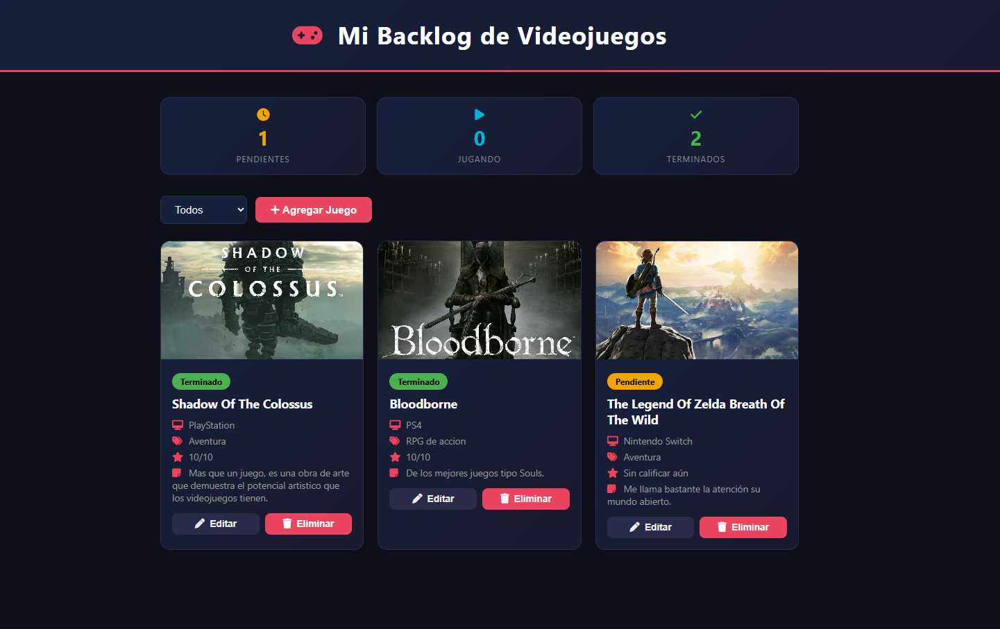

# Sistema Backlog de Videojuegos

Autor: Osmarlys David Flores Salas

Aplicación web para gestionar tu backlog personal de videojuegos: registra los juegos que quieres jugar, los que estás jugando y los que ya terminaste, junto con calificación, portada y notas personales.



## Funcionalidades

- Agregar, editar y eliminar videojuegos del backlog
- Filtrar por estado (pendiente, jugando, terminado)
- Contadores automáticos por estado
- Ver el detalle completo de cada juego
- Calificar juegos del 1 al 10
- Portada e imagen personalizada por juego
- Validaciones de formulario
- Persistencia de datos en MongoDB

## Tecnologías

| Capa | Tecnología |
|---|---|
| Backend | Node.js, Express 5 |
| Base de datos | MongoDB + Mongoose |
| Frontend | HTML, CSS, JavaScript (vanilla) |

## Instalación y ejecución local

1. Clona el repositorio:
   ```bash
   git clone https://github.com/TU-USUARIO/backlog-videojuegos.git
   cd backlog-videojuegos
   ```

2. Instala las dependencias:
   ```bash
   npm install
   ```

3. Crea un archivo `.env` en la raíz del proyecto con:
   ```
   PORT=3000
   MONGO_URI=mongodb://localhost:27017/backlog
   ```

4. Asegúrate de tener MongoDB corriendo localmente (o usa una URI de MongoDB Atlas).

5. Inicia el servidor:
   ```bash
   npm run dev
   ```

6. Abre http://localhost:3000 en tu navegador.

## Estructura del proyecto

```
├── index.js              # Punto de entrada del servidor
├── server/
│   ├── models/            # Esquemas de Mongoose
│   └── routes/             # Rutas de la API REST
├── public/                # Frontend (HTML, CSS, JS)
├── package.json
└── .env                   # Variables de entorno (no incluido en el repo)
```

## Endpoints de la API

| Método | Ruta | Descripción |
|---|---|---|
| GET | `/api/juegos` | Obtiene todos los videojuegos |
| POST | `/api/juegos` | Crea un nuevo videojuego |
| PUT | `/api/juegos/:id` | Actualiza un videojuego existente |
| DELETE | `/api/juegos/:id` | Elimina un videojuego |